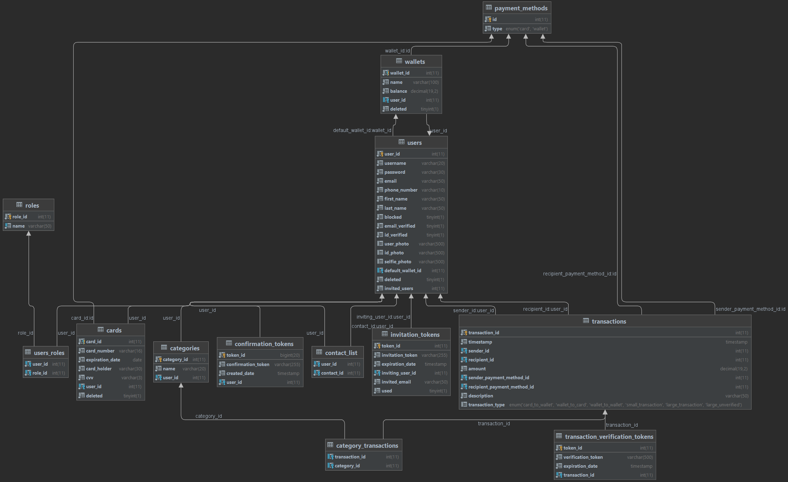



## Virtual Wallet

### Description
We are happy to present you **Virtual Wallet** - a web application that enables you to manage your budget. Every user can send and receive money (user to user) and put money in his Virtual Wallet (bank to app).
We have also provided customer contacts and spending categories for better usability!

### Technologies used:
* **JDK 11**
* **Spring Boot framework**
* **MariaDB**
* **Hibernate**

### How to build the project:
Firstly, you need to download the project folder.

You also need a MariaDB database which you can create and fill using the provided scripts.

Then you should edit the settings in the **application.properties** file in **\virtual-wallet\src\main\resources**.

After completing the previous steps, you can run the **VirtualWalletApplication.class**

### Swagger Documentation:
We have also provided a Swagger API Documentation that is accessible at http://domain.com/swagger-ui/index.html

### Database Relations

*Pss.. there is an **extremely low chance** of an Eastern Egg appearing! :)*